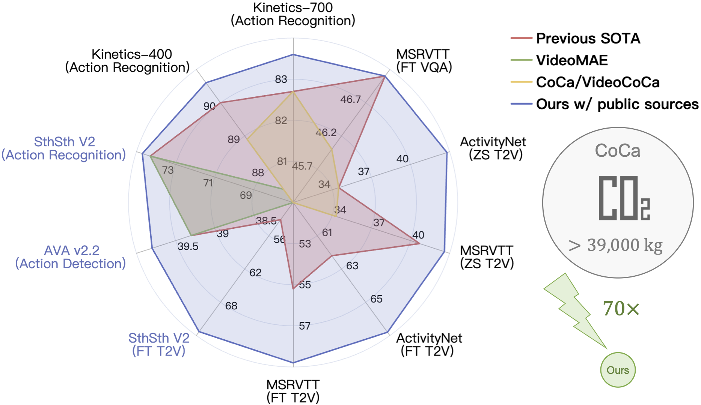
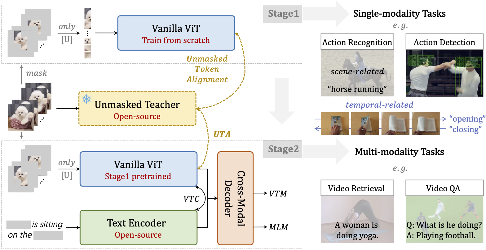

# Unmasked Teacher

This repo is the official implementation of ["Unmasked Teacher: Towards Training-Efficient Video Foundation Models"]().
By [Kunchang Li](https://scholar.google.com/citations?user=D4tLSbsAAAAJ), [Yali Wang](https://scholar.google.com/citations?user=hD948dkAAAAJ), [Yizhuo Li](https://scholar.google.com/citations?user=pyBSGjgAAAAJ), [Yi Wang](https://scholar.google.com.hk/citations?hl=zh-CN&user=Xm2M8UwAAAAJ), [Yinan He](https://dblp.org/pid/93/7763.html), [Limin Wang](https://scholar.google.com/citations?user=HEuN8PcAAAAJ) and [Yu Qiao](https://scholar.google.com/citations?user=gFtI-8QAAAAJ&hl).


## Update

Code and models will be released soon.

## Introduction

Video Foundation Models (VFMs) have received limited exploration due to high computational costs and data scarcity. Previous VFMs rely on Image Foundation Models (IFMs), which face challenges in transferring to the video domain. Although VideoMAE has trained a robust ViT from limited data, its low-level reconstruction poses convergence difficulties and conflicts with high-level cross-modal alignment. This paper proposes a training-efficient method for temporal-sensitive VFMs that integrates the benefits of existing methods. To increase data efficiency, we mask out most of the low-semantics video tokens, but selectively align the unmasked tokens with IFM, which serves as the UnMasked Teacher (UMT). By providing semantic guidance, our method enables faster convergence and multimodal friendliness. With a progressive pre-training framework, our model can handle various tasks including scene-related, temporal-related, and complex video-language understanding. Using only public sources for pre-training in 6 days on 32 A100 GPUs, our scratch-built ViT-L/16 achieves state-of-the-art performances on various video tasks.



##  Cite

If you find this repository useful, please use the following BibTeX entry for citation.

```latex
@misc{li2023unmasked,
      title={Unmasked Teacher: Towards Training-Efficient Video Foundation Models}, 
      author={Kunchang Li and Yali Wang and Yizhuo Li and Yi Wang and Yinan He and Limin Wang and Yu Qiao},
      year={2023},
      eprint={2303.16058},
      archivePrefix={arXiv},
      primaryClass={cs.CV}
}
```